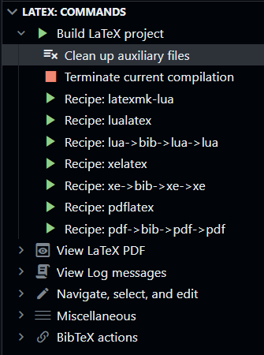

# Individual Report Template for ZJU-UIUC ECE 445: Senior Design Project Lab

ZJUI毕业设计个人报告（Individual Report）的$\LaTeX$模板。

## 初衷
只是一个LaTeX爱好者想整点花活。ZJU主校区有自己的毕业设计LaTeX模板，ZJUI不能落下。

慢慢来，做着看吧。

## 许可
本模板（除`references.bib`和`commitment_v4.tex`中的所有内容）根据MIT协议开放源代码。

`references.bib`中条目版权根据其所属数据库与作者的协议归数据库和/或作者所有。

`commitment_v4.tex`中的所有内容来自浙江大学ZJU-UIUC联合学院通过ECE445: Senior Design Lab课程的Blackboard网站下发的`commitment_V4.pdf`文档。

## 用法
本模板基于`book`类编写，默认使用a4paper纸张、11磅字（与院方下发模板一致），页边距2.54cm（约1英寸）。

### $\LaTeX$基本语法
可参考：[Learn LaTeX in 30 minutes - Overleaf, Online LaTeX Editor](https://www.overleaf.com/learn/latex/Learn_LaTeX_in_30_minutes)

### 新命令

**本仓库根目录下的`sample_report.tex`提供了一个开箱即用的样本，您可以根据需要填写、删除信息并编译。**

本仓库提供的一系列新命令列举如下：

#### 报告信息类

`\reporttitle{<Title>}`定义项目的标题。标题将出现在封面填写项目名称的位置上。

`\reporttype{<Type>}`定义报告的类型。**该项仅在通用报告封面上出现。**

`\semester{<Semester>}`定义报告所属的学期，如Spring 2023。将出现在封面上。

`\sponsor{<FacultyName>}`定义指导教师姓名。将出现在封面上。**该项仅在个人报告封面生效。**

`\ta{TAName}`定义分管TA的姓名。将出现在所有封面上。

`\reportdate{<Date>}`定义报告的撰写日期。将出现在所有封面上。

`\projectnumber{<Number>}`定义项目编号。**仅在Final Report和个人报告封面出现。**

`\teamnumber{<Number>}`定义组号。**仅在Final Report和通用报告封面上出现。**

#### 封面生成类

`\individualreportcover`将生成一个个人毕业设计报告的封面。个人毕业设计报告（Senior Design Individual Report）用于ZJU-UIUC联合学院本科生申请浙江大学学位。

`\finalreportcover`将生成一个Final Report的封面。

`\generalreportcover`将生成一个通用的封面（例如Individual Progress Report）。通用封面包含报告的类型（例如Individual Progress Report）和标题（填写项目名称）。

### 以下命令已弃用

~~`\student{<Name>}{<Email>}`生成一个学生信息字符串，格式为粗体姓名+带`mailto`超链接的电子邮件地址。常配合`\authorname{}`使用。~~ 已弃用。

~~`\authornames{<AuthorInfo>}`定义作者信息，可以是单行也可以是多行。例如，`\authorname{\student{Zhang San}{san@example.com} \\ \student{Li Si}{si@example.com}}`。~~ 已弃用。

~~`\keywordsabstract{<KeyWords>}{Abstract}`定义了在摘要页将出现的内容，包括关键词（在下）和摘要本体（在上）。~~ 已弃用。

~~`\acknowledgement{<Acknowledgement>}`定义了在声明、致谢页将出现的内容。~~ 已弃用。

~~`\makeAbstractAcknowledgementToc`插入摘要、声明致谢和目录。单独做一个命令的原因在于这三个页面的页码格式（使用小写罗马数字）与正文不同，使用单独命令更容易实现，使用也更灵活。对于不需要这些内容的通用报告（例如，个人进度报告 Individual Progress Report），不书写这条命令便可以不打印摘要和致谢。~~ 已弃用。

~~`\makeToc`插入目录页，其中目录页的页码使用小写罗马数字。~~ 已弃用。

### 文献管理
本模板的引文插入强烈依赖`biblatex`。模板调用`biblatex`宏包，自动生成IEEE格式引文。推荐使用开源文献管理工具Zotero（ https://zotero.org/ ）配合其附加组件BetterBibTeX（ https://github.com/retorquere/zotero-better-bibtex ）进行文件管理。BetterBibTeX允许用户将文献库中的条目导出为biblatex的参考文献文件，并可设置自动更新。在导言区使用`\addbibresource{<FileName>}`命令即可指定文档所使用的`biblatex`数据库文件。

`biblatex`宏包文档：[The biblatex Package](http://mirrors.ctan.org/macros/latex/contrib/biblatex/doc/biblatex.pdf)

IEEE格式引文参考：[IEEE Reference Guide -- IEEE Author Center](https://ieeeauthorcenter.ieee.org/wp-content/uploads/IEEE-Reference-Guide.pdf)

Zotero的使用说明：[Zotero Documentation](https://www.zotero.org/support/)

BetterBibTeX的使用说明：[Better BibTeX for Zotero :: Better BibTeX for Zotero (retorque.re)](https://retorque.re/zotero-better-bibtex/)

### 查看成品：编译

由于模板采用了BibLaTeX作为引文工具，您需要特别注意编译过程。限于笔者精力，详细信息不在此放出（主要原因是我也不会直接用命令行编译……）。如果您不了解具体如何编译，笔者建议您采用以下两种方案：

1. 采用在线$\LaTeX$编辑平台，如Overleaf。这类平台能自动处理如文献引用、图片编号等交叉引用的问题。（其后端应该是采用了`latexmk`的编译方式）

2. **在您本地使用微软Visual Studio Code软件+相应插件**：到VSCode的Marketplace下载插件"LaTeX Workshop"，并在设置中找到“Latex-workshop > Latex: Recipes”项，点击“在 settings.json 中编辑”，删除原有`"latex-workshop.latex.tools"`和`""latex-workshop.latex.recipes"`项的内容，并将以下内容复制到您的`settings.json`文件中：

   ```json
   "latex-workshop.latex.tools": [
       {
           "name": "xelatex",
           "command": "xelatex",
           "args": [
               "-synctex=1",
               "-interaction=nonstopmode",
               "-file-line-error",
               "%DOCFILE%"
           ]
       },
       {
           "name": "latexmk-lua",
           "command": "latexmk",
           "args": [
               "-lualatex",
               "-synctex=1",
               "-file-line-error",
               "-interaction=nonstopmode",
               "%DOCFILE%"
           ]
       },
       {
           "name": "pdflatex",
           "command": "pdflatex",
           "args": [
               "-synctex=1",
               "-interaction=nonstopmode",
               "-file-line-error",
               "%DOCFILE%"
           ]
       },
       {
           "name": "lualatex",
           "command": "lualatex",
           "args": [
               "-synctex=1",
               "-interaction=nonstopmode",
               "-file-line-error",
               "%DOCFILE%"
           ]
       },
       {
           "name": "bibtex",
           "command": "bibtex",
           "args": [
               "%DOCFILE%"
           ]
       },
       {
           "name": "latexmk-clean",
           "command": "latexmk",
           "args": [
               "-c"
           ]
       }
   ],
   "latex-workshop.latex.recipes": [
       {
           "name": "latexmk-lua",
           "tools": [
               "latexmk-lua"
           ],
       },
       {
           "name": "lualatex",
           "tools": [
               "lualatex"
           ],
       }
       {
           "name": "lua->bib->lua->lua",
           "tools": [
               "lualatex",
               "bibtex",
               "lualatex",
               "lualatex"
           ]
       },
       {
           "name": "xelatex",
           "tools": [
               "xelatex"
           ],
       },
       {
           "name": "xe->bib->xe->xe",
           "tools": [
               "xelatex",
               "bibtex",
               "xelatex",
               "xelatex"
           ]
       },
       {
           "name": "pdflatex",
           "tools": [
               "pdflatex"
           ]
       },
       {
           "name": "pdf->bib->pdf->pdf",
           "tools": [
               "pdflatex",
               "bibtex",
               "pdflatex",
               "pdflatex"
           ]
       }
   ], // 若本行后无设置项，则将逗号删除
   ```

   随后点击左边栏的“TEX”按钮，展开“Build LaTeX project”项，您将看到：

   

   通常我们使用"xe->bib->xe->xe"，或"lua->bib->lua->lua"，或"latexmk-lua"项进行编译。**使用pdflatex或“pdf->bib->pdf->pdf”编译可能导致意外错误，这不是BUG，是一些宏包的特性！**部分宏包只能使用Xe$\TeX$或Lua$\TeX$正常编译。

LaTeX Workshop插件的使用说明：[Home · James-Yu/LaTeX-Workshop Wiki (github.com)](https://github.com/James-Yu/LaTeX-Workshop/wiki)

微软Visual Studio Code的使用说明：[Documentation for Visual Studio Code](https://code.visualstudio.com/Docs)

## 联系我
Email: zhongmartin@outlook.com